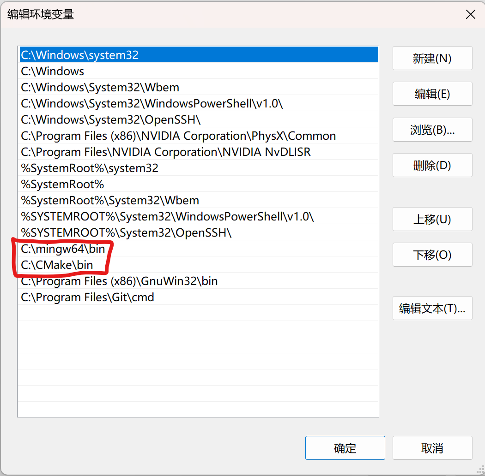

请用markdown编辑器打开此文件。

# 环境配置
CMake安装教程：https://blog.csdn.net/Natsuago/article/details/145662289

mingw64安装教程：
首先进入图中网页，然后点击其github界面，下载源文件

下载时选：架构**86_64**、线程模型**posix**、异常处理**seh**。

参考下载选项如下

把获得的压缩包解压到C盘根目录，然后把其中的bin目录添加到系统环境变量中即可。



检验方法：在命令行中运行`cmake --version`，若输出版本信息则cmake安装成功。
在命令行中运行`gcc --version`，若输出版本信息则mingw64安装成功。


# 编译命令

根目录下运行如下命令

```
cmake -B build -G "MinGW Makefiles"
cmake --build build
```

在bin目录下生成exe，示例运行如下

```
 .\bin\ray_tracing.exe
```
